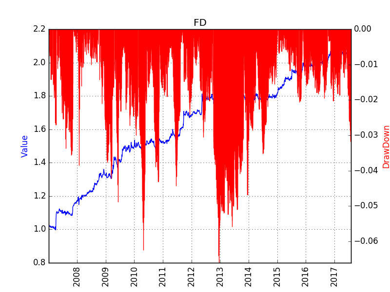

5 day Moving Average is equivalent with a low pass fitler with coefficients b = [0.2, 0.2, 0.2, 0.2, 0.2] and a = 1. 
The volatility is relatively high frequency (from day to day), when compared with the price move on a 5 day range. The trend is mostly hidden in the low-frequency area in the frequency domain. 

All the efforts to recognize the trend of price movement is actually searching for the informative low frequency components in the frequency domain. Shedding the communicaition techniques on the strategy field, we can leverage the filter design knowledge on our tasks. 

# Filters
In terms of frequency response, filters can be classified into low pass filter, high pass filter, band pass filter, band stop filter. Because trend is usually hidden in the low frequency domain, low pass filter (LP) and band pass filter (BP) are used in our tasks. 

Digital filters can be classfied into two types: IIR and FIR. 
IIR has short latency, but it is not stable (output is feedbacked to intput). 
FIR has long latency, but it is stable. 
For now, FIR is used to extract the low frequency domain trend. 

# Back Test Result
The strategy is tested on all the products trading in the three Commodity Future Markets in China, including SHFE, DCE, CZCE, between Jan 1st 2005 and Aug 1st 2017. Trading cost is set at 3%% either for buy or sell.

# Known Problems
## Latency of the Filter
Let us use the 5 day Moving Average line again. The average price we found on Day 5 is actually corresponding to the trend of the 3 day, the 2 day latency is the obastacle of using the filter techniques. However, we can never know the real trend on Day 5, because it is relying on the Day 3, Day 4, Day 5, Day 6 (Future), Day 7(Future) data.

