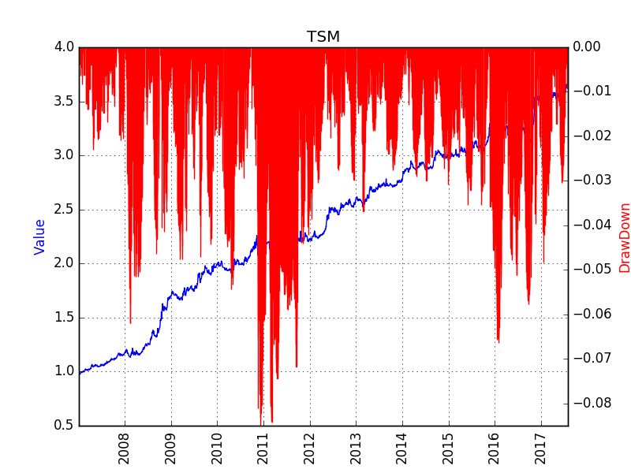

# Time Series Momentum 
More academic resources can be found [here](https://scholar.google.com/scholar?hl=en&q=time+series+momentum&btnG=&as_sdt=1%2C5&as_sdtp=)

Although not a securet for a long time, following market move has been profitable in the past century[Moskowitz2011](http://www.sciencedirect.com/science/article/pii/S0304405X11002613). Different trend following strategies are only different at the criterion of the start/end of a trend. 

# Back Test Result
The strategy is tested on all the products trading in the three Commodity Future Markets in China, including SHFE, DCE, CZCE, between Jan 1st 2005 and Aug 1st 2017. Trading cost is set at 3%% either for buy or sell, and no leverage is used. The potential risk free return is not included.

# Known Problems
## Path Dependency
Once entering the market, the position will be held for a period, which means there is a period (between a week to several months, depending on the strategy parameters) when no trade happens (this strategy is different from the conventionalstrategies like DualThurst, RBreak). The final performance of the strategy is affected by the starting date of test. 

Although there is no perfect solution on this, some statistical features are found to mitigate such dependeces. 

Another solution is to divide all the positions into N divisions (N is the days to hold the position), and adjust position every day on one division. 

## Drop of Performance in Recent Years
Unfortunatelly, this simple Time Series Momentum strategy brings lower return and higher volatility recently. This can be partially attributed to the popularity of automatic trading in recent years. Simplly following the market may be a risky behavior in the near future. 

