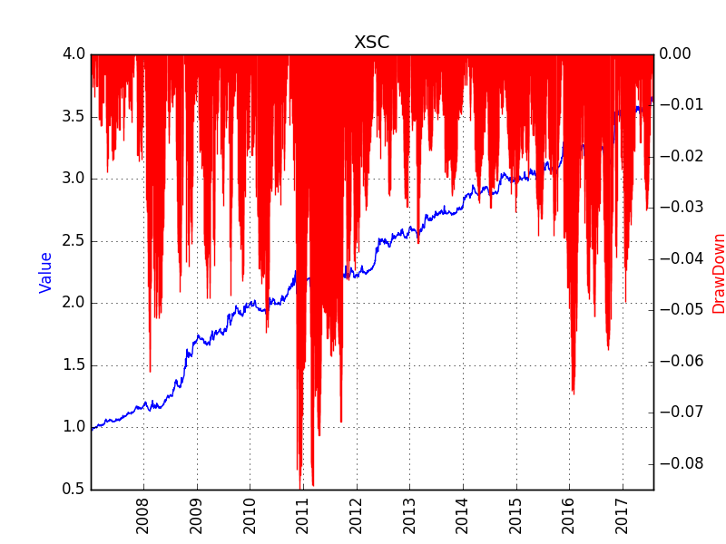

The currency carry trade is a strategy in which an investor sells a certain currency with a relatively low interest rate and uses the funds to buy a different currency yielding a higher interest rate. 

Although there is no interest in a commodity future contract, the discout rate plays the role. A commodity contract that is now traded at discount (with high discount rate), is equivalent with a currency with high interest rate. Assuming the the price of actuals is stable, then the price of the commodity future traded at discount rate will converge to that of the actual. 

# Back Test Result
The strategy is tested on all the products trading in the three Commodity Future Markets in China, including SHFE, DCE, CZCE, between Jan 1st 2005 and Aug 1st 2017. Trading cost is set at 3%% either for buy or sell, and the leverage is 250%. 

# Known Problems
## Path Dependency
Once entering the market, the position will be held for a period, which means there is a period (between a week to several months, depending on the strategy parameters) when no trade happens (this strategy is different from the conventionalstrategies like DualThurst, RBreak). The final performance of the strategy is affected by the starting date of test. 

Although there is no perfect solution on this, some statistical features are found to mitigate such dependeces. 

Another solution is to divide all the positions into N divisions (N is the days to hold the position), and adjust position every day on one division. 

## Trading on Friday
The performance of the strategy is partially affected by the day of week. Usually, Friday is the best day to trade. It is a statistical phenomenon. 

## Trading in Third Week
This is mostly due to deliving setting. Deliverying happens in the 3rd Friday of each month. 

## Conflict with the Momentum
There are times when a contract is traded at discount, while this product (including the dominant contract) is dropping. The momentum of the contract price affects the decision to follow the smart carry strategy. 

