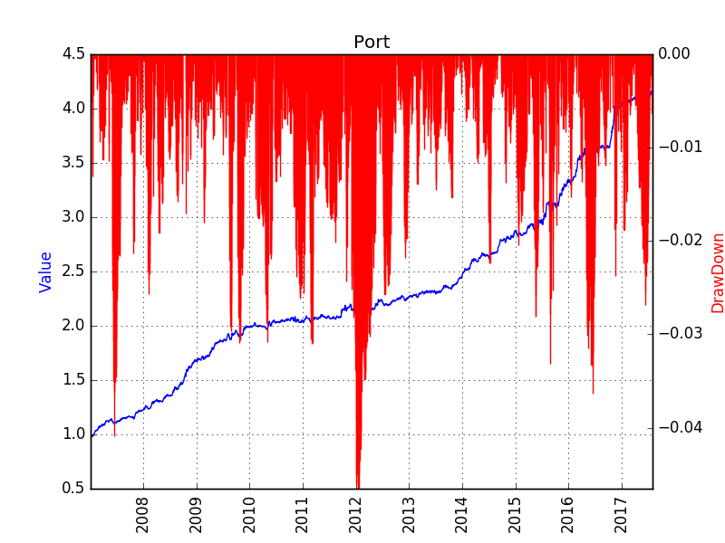

# Risk-Parity: determine the strategy's weight
The weight of a product's position is determined by its standard deviation's reciprocal. More academic resources can be found in [Qian2005](http://www.dailyalts.com/wp-content/uploads/2014/06/Risk-Parity-and-Diversification.pdf)

For better cash management, the total weight is always constant, and the individual risk is used to determine the relative importance in the portfolio. 

# Component of different strategies
Using risk-parity to determine weights, we can get a portfolio value for each strategy, such as the Time Series Momentum (TSM), Cross Sectional Momentum (XSM), Time Series Carry (TSC), Cross Sectional Carry (XSC). These strategies are for the commodities. 
Also, using the French-Fama Three-Factor Model, we can get an alpha portfolio in the stock market (STOCK). 

The alpha portfolio is constructed using the Eugene-Fama three factor model, exposing to the Price to Book Value and the Non Restricted Cap.

# correlation coefficients of different strategies

# Known Problems
## How to distribute the weights to different products
1. the lookback period for calculating the product's risk
2. the method to calculate the product's risk. a) standard deviation; b) exponential weighted moving average of standard deviation; c) other risk measures. 
3. how to determine the total weight of the portfolio. If all the products are volatile, then holding more cash is a better option. 

