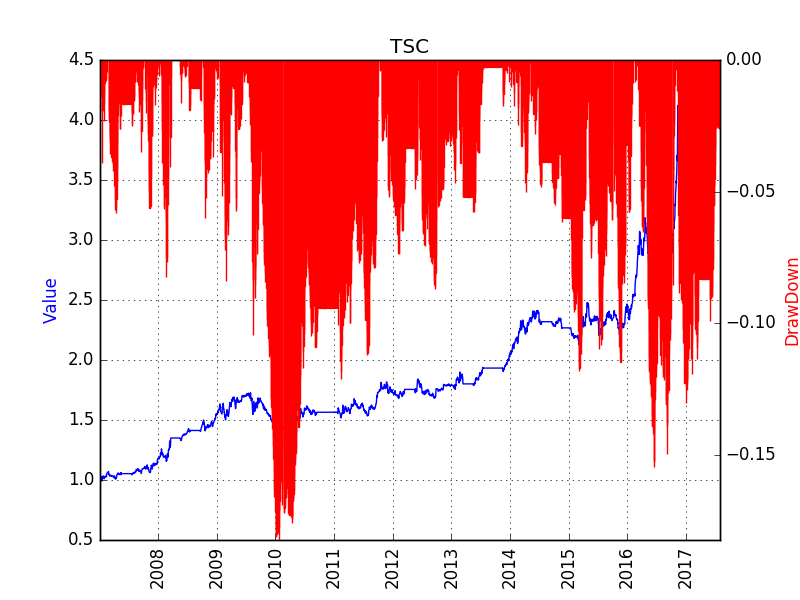

# Time Series Carry 
The shrinking/enlarging of the carry return of a product also contains a trend to be captured. 
For contango products (near month is lower than deferred month), the shrinking carry return means the deferred month price is converging to the near month, thus a short position on dominant contract is preferred.
For backwardation products (near month is higher than deferred month), the shrinking carry return means the deferred month price is converging to the near month, thus a long position on dominant contract is preferred.

# Back Test Result
The strategy is tested on all the products trading in the three Commodity Future Markets in China, including SHFE, DCE, CZCE, between Jan 1st 2005 and Aug 1st 2017. 
Trading cost is set at 3%% either for buy or sell, and no leverage is used. The potential risk free return is not included.

# Known Problems
## Path Dependency
In implementation, this idea is characterized by several parameters, as listed below:
1. the threshold of shrinking/noise. 
2. the lookback period to calculate the shrinking of the carry return
3. the threshold of the carry return to determine contango / backwardation.
Potential overfitting exists in backtesting. 

## Future works
1. How to calculate the carry return. a) between the near month and the deferred month; b) between the near month and the dominant contract; c) between the dominant contract and the sub-dominant contract. 
2. Use moving average of the carry return, or compound carry return. 

## Conflict with Inter Temporal Arbitrage
Essentially, this strategy is like the Inter Temporal Arbitrage

