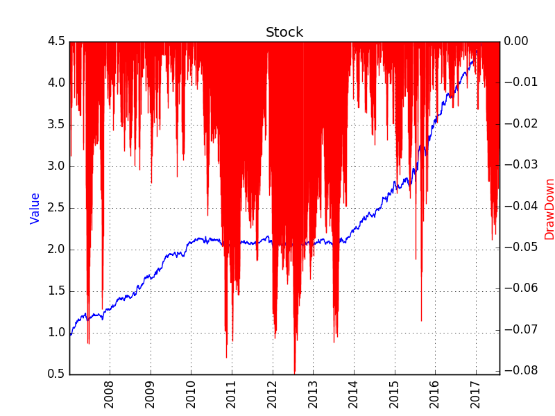

# Back Test Result
The strategy is tested on all the products trading in the three Commodity Future Markets in China, including SHFE, DCE, CZCE, between Jan 1st 2007 and Aug 1st 2017. Trading cost is set at 3%% either for buy or sell, and no leverage is used. The potential risk free return is not included.

# Known Problems
