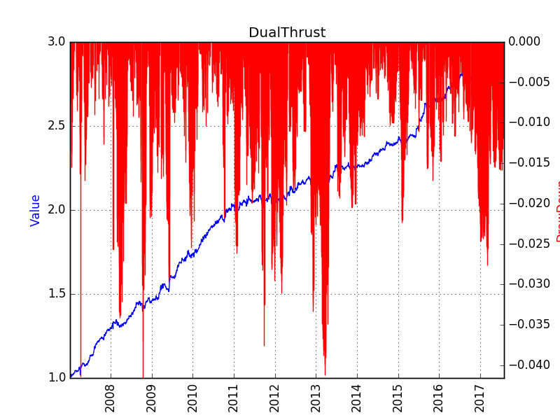
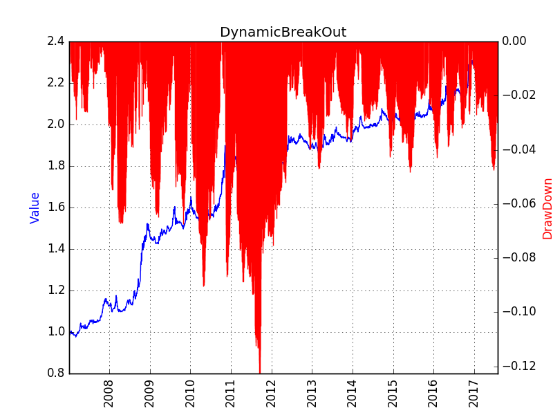

# Technical Analysis
Most techincal analysis strategies focus on trend following, and a smaller part on contrarian. Currently, we mainly focus on trend following. 

The recognition of a trend starts from a breakout. Usually there are two rails, upper and lower. The upward break of the upper rail means the start of up trend, and the downward break of the lower rail means the start of down trend. 

The famous [turtle rules](http://bigpicture.typepad.com/comments/files/turtlerules.pdf) are relying on the breaks, however, the more important part of the turtle rules is the distribution on positions. Products with high risk (large standard deviation in the past period) have lower weigths in the portfolio, and those with low risk have larger weights. This is actually the same with the Risk-Parity concept. How to calculate risk is another interesting problem, but for now, we only use the standard deviation. 

# DualThrust
A simple introduction can be found here [Dual Thrust Trading Algorithm](https://www.quantconnect.com/tutorials/dual-thrust-trading-algorithm/)

## Low Frequency Rails (daily bar)
1. Upper rail: Open + Interval (determined by past High, Low, Close)
2. Lower rail: Open - Interval (determined by past High, Low, Close)

## High Frequency Rails (1min bar)
DualThrust does not have high frequency rails.

## Back Test Result

# DynamicBreakOut
[Dynamic Break Out](https://www.quantconnect.com/tutorials/dynamic-breakout-ii-strategy/)

## Low Frequency Rails (daily bar)
1. Upper rail: Bollinger Band Upper Rail
2. Lower rail: Bollinger Band Lower Rail

## High Frequency Rails (1min bar)
1. Upper rail: moving average of daily high
2. Lower rail: moving average of daily low

## Back Test Result

# Keltner
[Keltner Strategy](https://www.thebalance.com/how-to-day-with-trade-keltner-channels-4051613)

## Low Frequency Rails (daily bar)
No low frequency rails.

## High Frequency Rails (1min bar)
1. Upper rail: moving average of close (1min) + ATR (1min)
2. Lower rail: moving average of close (1min) - ATR (1min)

## Back Test Result

# Dochian
[Dochian Strategy](https://admiralmarkets.com/education/articles/forex-indicators/what-everyone-should-know-about-the-donchian-channel-indicator)

## Low Frequency Rails (daily bar)
No low frequency rails.

## High Frequency Rails (1min bar)
1. Upper rail: moving average of high (1min)
2. Lower rail: moving average of low (1min)

## Back Test Result

# Summary
The strategies are relying on a lot of parameters defining the rails and intervals. Thus, overfitting may exists among them. Trend following is the most successful strategy in the past two century [Two centuries of trend following](https://arxiv.org/abs/1404.3274), the trend recognition deserves more exploration. 

